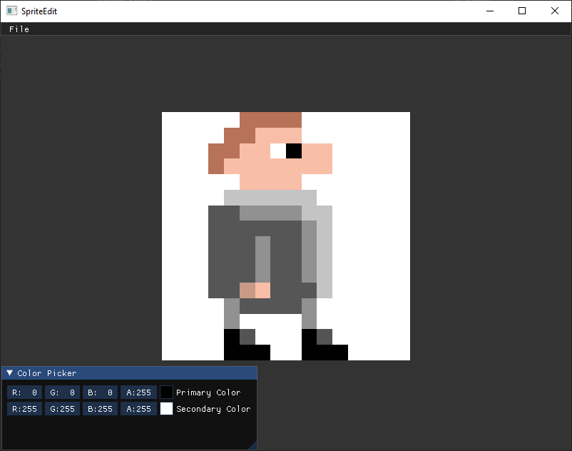

# SpriteEdit

SpriteEdit is a simple OpenGL-based sprite editor.

## Features

- Loading existing images
- Drawing single pixels in one of two active colours (left or right click)

## Supported platforms

Currently only Windows is supported.

## Building

**Dependencies (as installed using [VCPKG](https://github.com/microsoft/vcpkg)):**

- opengl
- glew
- glfw3
- glm
- sail
- imgui
- imgui[glfw-binding]
- imgui[opengl3-glew-binding]
- spdlog

After installing the dependencies the project can be built using **MSBuild/Visual Studio**.

## License

Licensed under the [MIT License](./LICENSE);
